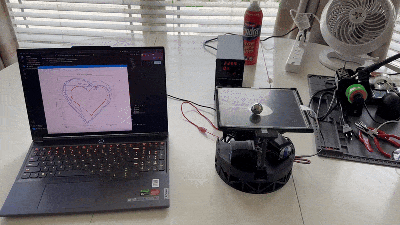

# Ball Balancing Bot

**A robotics project that uses real-time control and inverse kinematics to keep a ball stable on a movable platform.**

---

## Project Overview

The **Ball Balancing Bot** combines mechanical design, electronics, and control theory to actively stabilize a ball using a 3-degree-of-freedom parallel manipulator.  
It serves as both a hands-on robotics challenge and a learning platform for inverse kinematics, sensor integration, and feedback control.

If you want to see the full build process, circuit assembly, and code integration, check out the **Instructables tutorial**:  
[**DIY Ball Balancer Robot! : 6 Steps with Pictures (with Pictures)**](https://www.instructables.com/Lets-Make-a-Ball-Balancer-Robot/)

---

## Repository Contents

- **`BallBalancingBot/`** – Core control implementation (C++).
- **`CAD Files and STLs/`** – 3D printable and editable CAD files for the mechanical frame.
- **`Python Plotters/`** – Scripts for plotting system performance and visualizing motion data.
- **`Ball Balancing Robot Circuit Documentation.pdf`** – Detailed circuit diagrams and wiring instructions.
- **`Ball Balancing Robot IK Derivation.pdf`** – Full symbolic derivation of the inverse kinematics equations.
- **`circuit_image.png`** – Quick reference circuit schematic.

---

## Features

- Complete inverse kinematics derivation for a 3-RRS parallel manipulator.
- Modular CAD/STL files for easy reproduction and modification.
- Circuit documentation with clear wiring diagrams.
- Python visualization tools for trajectory and control analysis.

---

## Project Structure

ball-balancing-bot/
│
├── BallBalancingBot/ # Core control implementation

├── CAD Files and STLs/ # Mechanical component models

├── Python Plotters/ # Visualization scripts

├── Ball Balancing Robot Circuit Documentation.pdf

├── Ball Balancing Robot IK Derivation.pdf

├── circuit_image.png

└── README.md

---

## License

This work is licensed under the **Creative Commons Attribution-NonCommercial-ShareAlike 4.0 International License**.  
You are free to share and adapt the material for non-commercial purposes, as long as you give appropriate credit and distribute your contributions under the same license.

---
